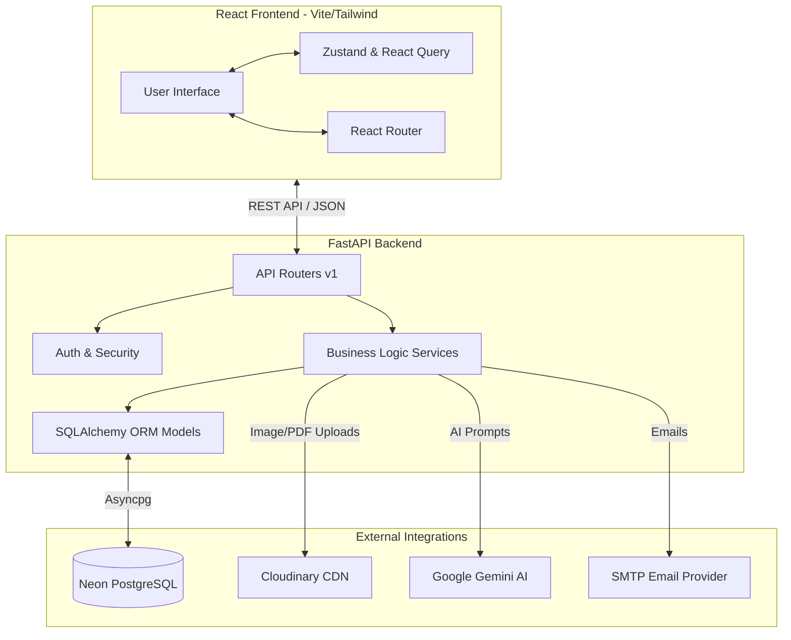
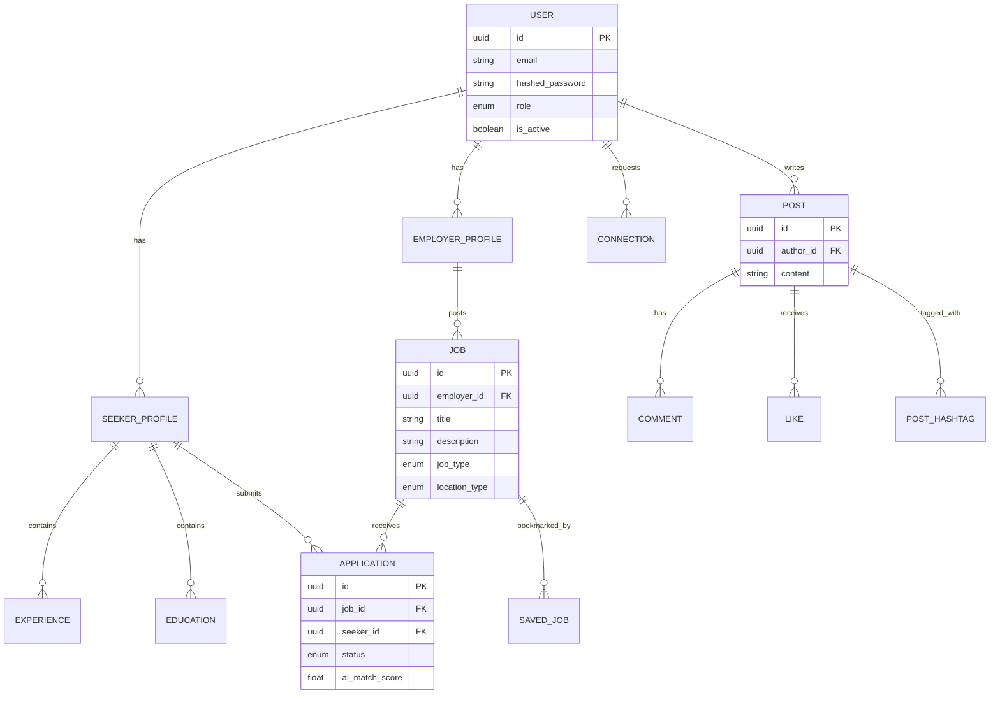

# JobNest 🎨

JobNest is a modern, LinkedIn-style career platform bridging the gap between social networking and professional job hunting. It offers a comprehensive suite of features for job seekers and employers, enhanced with AI intelligence for better resume matching and profile optimization.

---

## 🌟 Key Features

### 👤 For Job Seekers
- **Detailed Profiles**: Manage experience, education, skills, certifications, and languages.
- **Job Discovery & Applications**: Search jobs with advanced filters, save jobs, and apply directly.
- **AI-Powered Insights**: Get AI-generated resume reviews, match scores for specific jobs, and profile optimization tips.
- **Social Networking**: Post updates, like, comment, use hashtags, and connect with other professionals.
- **Real-time Messaging & Notifications**: Stay up-to-date with application statuses and network interactions.

### 🏢 For Employers
- **Company Profiles**: Build a brand presence with detailed company pages.
- **Job Management**: Create, edit, and manage job postings.
- **AI Assistance**: Generate compelling job descriptions automatically using AI.
- **Applicant Tracking**: View applicants, review resumes, and manage application statuses.

### 🛡️ Admin & Moderation
- **Dashboard**: Track platform metrics (users, jobs, posts, reports).
- **User & Job Management**: Suspend users or archive jobs when necessary.
- **Moderation**: Handle user reports for posts, jobs, or other users to maintain a safe community.

---

## 🏗️ Tech Stack

### Frontend 🌐
- **Framework**: React 18 + Vite + TypeScript
- **Styling**: Tailwind CSS + Shadcn UI (Radix base components)
- **Routing**: React Router DOM v6
- **State Management**: Zustand (global state) & React Query (server state / data fetching caching)
- **Animations**: Framer Motion & Tailwind Animate
- **Forms & Validation**: React Hook Form + Zod

### Backend ⚙️
- **Framework**: FastAPI (Python 3.11+)
- **Database & ORM**: PostgreSQL (Neon) + SQLAlchemy 2.0 (Async) + Alembic for migrations
- **Authentication**: JWT (JSON Web Tokens) with standard OAuth2 password bearer flow + bcrypt for hashing
- **AI Integration**: Google Gemini API (`google-genai`) for resume matching, reviews, and job descriptions
- **External Services**: Cloudinary (File/Resume/Image storage), FastAPI-Mail / aiosmtplib (Email notifications)
- **Architecture**: Service-Layer Pattern, Repository-like querying, Pydantic V2 schemas.

---

## 📊 System Architecture



---

## 🗄️ Database Schema & Models

The database consists of 20+ tables designed for high performance and integrity, utilizing UUID primary keys, soft deletes, and composite indices.



**Key Data Models:**
- **Core**: `User`, `EmailVerificationToken`, `PasswordResetToken`
- **Profiles**: `SeekerProfile`, `EmployerProfile`, `Experience`, `EducationEntry`, `Certification`, `Language`
- **Jobs**: `Job`, `Skill`, `SavedJob`, `JobSkill`, `SeekerSkill`
- **Activity**: `Application`, `Post`, `Comment`, `Like`, `Hashtag`, `PostHashtag`
- **Communication & Moderation**: `Message`, `Notification`, `Connection`, `Report`

---

## 🚀 Getting Started (Local Development)

### Prerequisites
- Node.js (v18+) & `npm` / `bun`  
- Python 3.11+ & `uv` package manager  
- PostgreSQL Database (Local or Neon)  
- Cloudinary Account (for uploads)  
- Google Gemini API Key (for AI features)  

### 1. Clone the repository
```bash
git clone https://github.com/your-username/jobnest.git
cd jobnest
```

### 2. Backend Setup
```bash
cd backend

# Install dependencies using uv
uv sync

# Set up environment variables
cp .env.example .env
# Edit .env and supply your DATABASE_URL, JWT_SECRET_KEY, CLOUDINARY_URL, GEMINI_API_KEY, SMTP settings, etc.

# Run database migrations
uv run alembic upgrade head

# Start the FastAPI server
uv run uvicorn app.main:app --reload --port 8000
```
Backend API docs will be available at: `http://localhost:8000/docs`

### 3. Frontend Setup
```bash
cd frontend

# Install dependencies
npm install
# OR if you prefer bun
bun install

# Configure environment variables
# Ensure your .env file or local equivalent has the correct API URL:
# VITE_API_URL=http://localhost:8000/api/v1

# Start the Vite development server
npm run dev
# OR
bun run dev
```
Frontend will be accessible at: `http://localhost:5173`

---

## 🚢 Deployment Guide

### Backend Deployment (e.g., Render, Railway, or Heroku)
1. Set up a PostgreSQL database (e.g., Neon serverless Postgres).
2. Connect your repository to the hosting platform.
3. Set the build command to install `uv` and run `uv sync`.
4. Set the start command to:
   ```bash
   alembic upgrade head && uvicorn app.main:app --host 0.0.0.0 --port $PORT
   ```
5. Add all production environment variables to the platform's deployment settings.

### Frontend Deployment (e.g., Vercel or Netlify)
1. Connect the `frontend` folder to Vercel/Netlify.
2. Build command: `npm run build` or `bun run build`.
3. Output directory: `dist`.
4. Add the `VITE_API_URL` pointing to your deployed backend URL.
5. Vercel will automatically handle client-side routing.

---

## 🤝 Contributing
Contributions are welcome! Please follow the established code styles:
- **Backend**: Use `ruff` for linting/formatting and utilize strong typing (`typing` module) along with Pydantic validations. Follow the Service-Repository pattern.
- **Frontend**: Follow consistent Shadcn UI design patterns. Keep components small, use Tailwind logically, and manage complex state securely via Zustand or React Query.

## 📄 License
This project is licensed under the MIT License.
